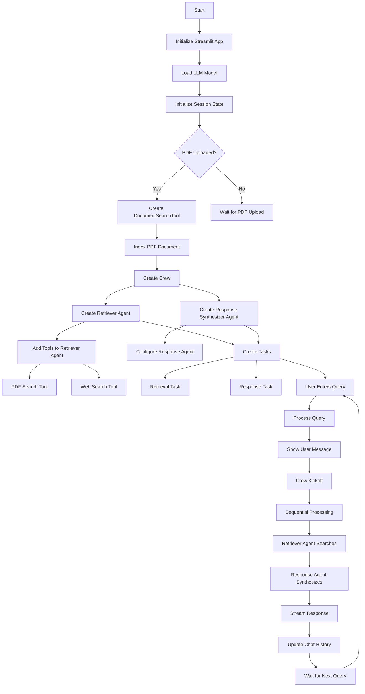

# 🤖 Agentic RAG using CrewAI

<div align="center">


</div>
A powerful Retrieval-Augmented Generation (RAG) system built with CrewAI that intelligently searches through documents and falls back to web search when needed. Features powerfull LLM support with Google's gemini.


This project is actively being improved with new features, but it's already fully functional and ready to use.


## 🌟 Features

- 📚 Document-based search with RAG capabilities
- 🌐 Automatic fallback to web search
- 🤖 Powerful Google's LLM support (gemini-2.0-flash)
- 🔄 Seamless integration with CrewAI
- 💨 Fast and efficient document processing
- 🎯 Precise answer synthesis

## 🔄 System Flow

Below is the detailed flow diagram of how the system processes queries and generates responses:



## 🚀 Prerequisites

Before running the application, ensure you have:

1. **API Keys**:
   - SEPER API key for web search capabilities
   - LLM API key 

2. **Python Environment**:
   - Python 3.11 or later
   - Conda (recommended for environment management)

## 💻 Installation

1. **Create and Activate Environment**:
   ```bash
   conda create -n env_crewai python==3.12 -y
   conda activate env_crewai
   ```

2. **Install Dependencies**:
   ```bash
   # Install package management tools
   uv lock
   uv sync

   # Install required packages
   pip install crewai crewai-tools markitdown qdrant-client fastembed
   ```

## 🎮 Running the Application

  ```bash
  streamlit run app.py
  ```

## 🛠️ System Architecture

The system consists of two main agents:

1. **Retriever Agent**:
   - Handles document searching
   - Manages web search fallback
   - Uses both PDF and web search tools

2. **Response Synthesizer Agent**:
   - Processes retrieved information
   - Generates coherent responses
   - Ensures context relevance

## 📚 Usage Examples

1. **Document Search**:
   - Upload your PDF document
   - Enter your query
   - Receive contextual answers from the document

2. **Web Search Fallback**:
   - System automatically detects when document search isn't sufficient
   - Seamlessly switches to web search
   - Combines information from multiple sources

## 🤝 Contributing

Contributions are welcome! Please feel free to submit a Pull Request.

1. Fork the repository
2. Create your feature branch (`git checkout -b feature/AmazingFeature`)
3. Commit your changes (`git commit -m 'Add some AmazingFeature'`)
4. Push to the branch (`git push origin feature/AmazingFeature`)
5. Open a Pull Request


